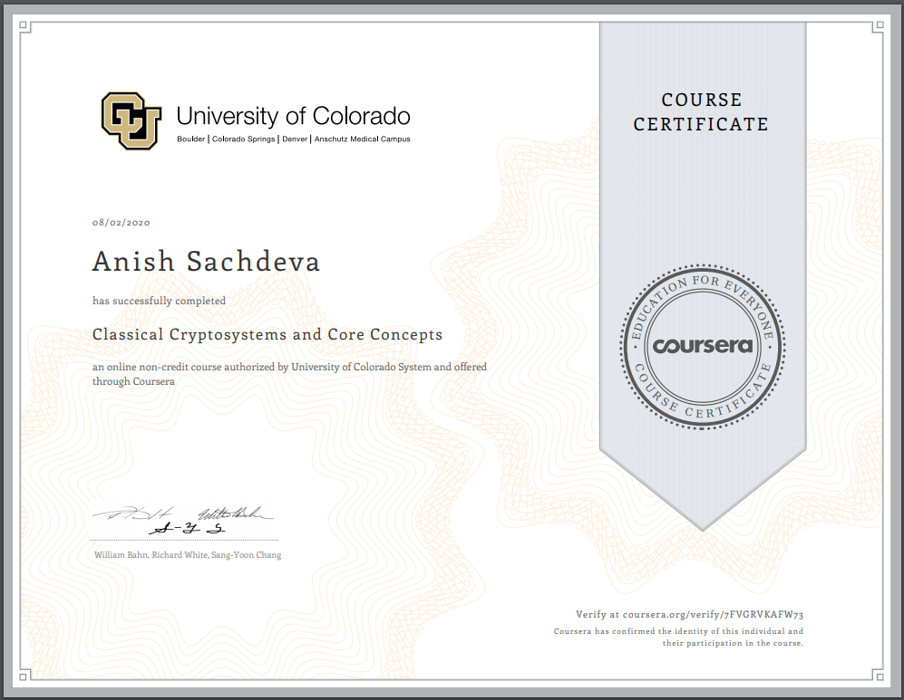

# Classical Cryptosystems and Core Concepts ~University of Colorado   

## Index
- [Week 1](#week-1)
- [Week 2](#week-2)
- [Week 3](#week-3)
- [Certificate](#certificate)

## Week 1
- [Practice Quiz: Cryptographic Tidbits](src/week1/practice-quiz-cryptographic-tidbits.md)
- [Quiz: Cryptographic Tidbits](src/week1/quiz-cryptographic-tidbits.md)

## Week 2
- [Practice Quiz: Cryptanalysis](src/week2/practice-quiz-cryptanalysis.md)
- [Quiz: Cryptanalysis](src/week2/quiz-cryptanalysis.md)

## Week 3
- [Practice Quiz: Hash Function](src/week3/practice-quiz-hash-functions.md)
- [Quiz: Hash Function](src/week3/quiz-hash-functions.md)

## [Certificate](https://www.coursera.org/verify/7FVGRVKAFW73)

